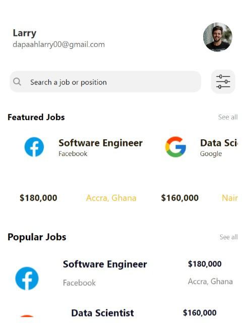
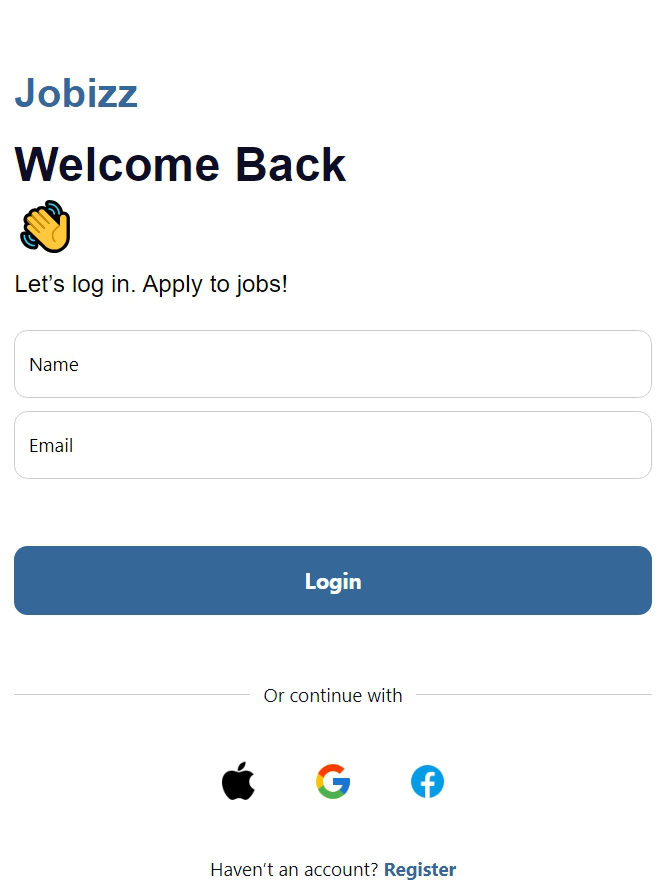

# Job Search App

This is a React Native application for browsing job listings and managing user profiles.

## Components

### `App.js`

The main entry point of the application that sets up navigation and initializes the app.

### `HomeScreen.js`

Displays the main dashboard of the application, including user information, a search bar (`SearchBar.js`), and sections for featured and popular jobs (`FeaturedJobs.js`, `PopularJobs.js`).

### `SearchBar.js`

A reusable component that provides a search input field for users to search for jobs or positions.

### `User.js`

Stores and manages user information such as name and email.

### `Jobs.js`

Stores all job listings and provides data for various job components (`FeaturedJobs.js`, `PopularJobs.js`).

### `LoginScreen.js`

Handles user authentication and login functionality.

### `FeaturedJobs.js`

Displays a horizontal scrollable list of featured job cards.

### `PopularJobs.js`

Displays a vertical list of popular job cards.

## Screenshots

### Screenshot 1

### Screenshot 2

